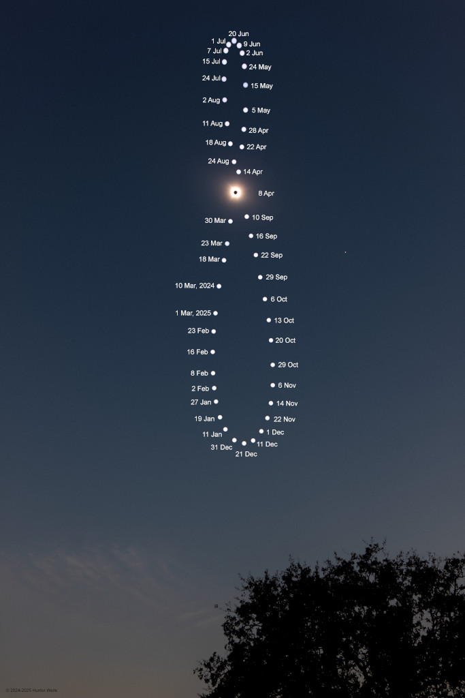

## 🚀 Proyecto con Requests y API de la NASA
Este proyecto es parte de mi aprendizaje sobre la biblioteca requests en Python para realizar peticiones a APIs. Utilizo un entorno gestionado con mamba y aplico lo aprendido en Platzi.
### 📌 Descripción
El script obtiene imágenes desde la API de la NASA y las guarda localmente.
### 🛠 Tecnologías usadas
* Python
* Requests
* Mamba (gestión de entornos) o tambien (Anaconda)

### 📥 Instalación y ejecución
#### 1. Clonar el repositorio:
```sh
git clone https://github.com/tu-usuario/tu-repositorio.git
cd tu-repositorio
```
##### 2. Crear y activar un entorno con mamba:
```sh
mamba env create -f environment.yml
mamba activate reqst
```
#### 3. Configurar la API key
Para usar la API de la NASA, necesitas una clave de acceso gratuita.
* Regístrate en api.nasa.gov y obtén tu API Key.
* Crea un archivo .env en la raíz del proyecto con este contenido
```
python main.py
```
